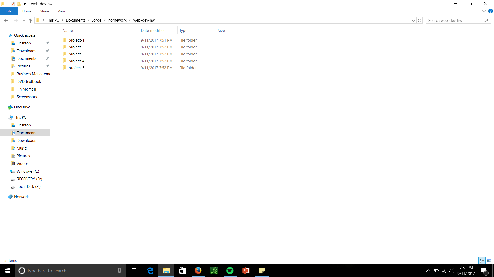

## Jorge Zavala

Part 2 of this project was where we started doing some hands-on learning.

---

We learned how to create and organize the files that make up a website. This included:

1. The importance of the index.html file.
2. Creating a directory and making it neat.
3. Proper file naming using underscores, camelCase, or hyphens.
4. Using markdown to crete a readme.md file like this one!

Other things w learned were:

- Writing in **bold**
- Wrtiting in *italics*
- You can write code in here like this `var=25`.
- Code blocks can also be written like this:
```markdown
code block
```
[Here is a link to GitHub](https://github.com/)

New line


